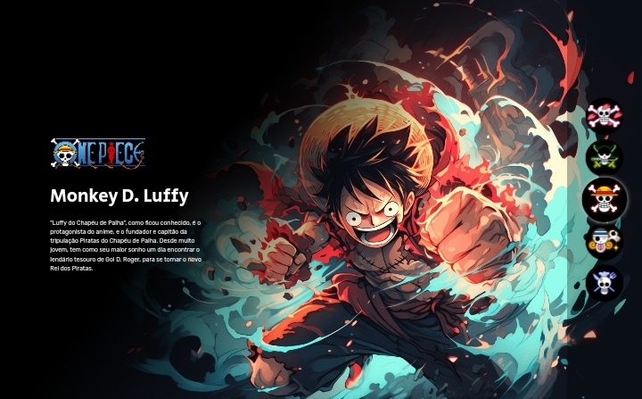

# 🚀 One Piece - Character Selector

Esse projeto foi feito no evento do Zero ao Código do Dev em Dobro

***

## 🚀 Sobre o Projeto
O projeto é um seletor de personagens com o tema da animação japonesa One Piece, baseado no mangá de mesmo nome.

***

## 🚀 Tecnologias Utilizadas
O projeto foi feito usando as seguintes tecnologias

- HTML e CSS
- JavaScript